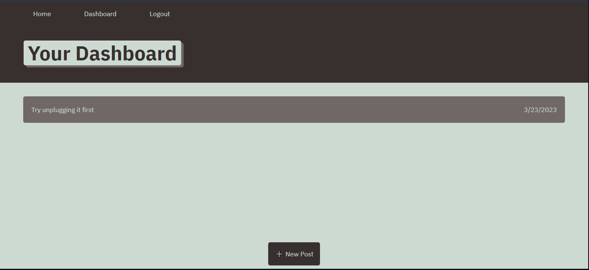

# Tech Blog 

## Description

This application includes a website where a user can log on and create a blog post which will be saved on a server for future viewing.

# Table of Contents

[Installation Information](#installInstructions)

[Usage Infromation](#usageInformation)

[Contributions Information](#contributions)

[Test Information](#testInstructions)

[License Information](#license)

[Contact Information](#contactMe)

## Installation

Please use the "npm i" command in the command line interface to install neccessary dependencies.

## Usage

Start the application by using the "node index.js" command in the command line interface.

## Contributors

n/a

## Test Information

n/a

## License Information

This project utilizes the MIT License. Please see [MIT License](https://www.mit.edu/~amini/LICENSE.md) for more information.

## Question or Concerns?

Please reach out with any questions or concerns.

Github Username: gharrison307  
 Email:
